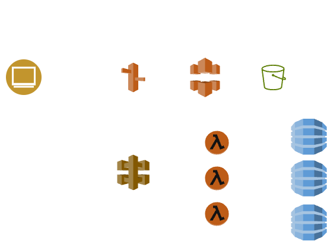

# Hotel Management System — Production-Ready AWS Serverless README

This document describes **how to deploy and operate your three microservice serverless app (room-service, booking-service, payment-service)** in an **advanced, secure, production-style AWS serverless architecture** using manual console / CLI steps (no IaC).  It implements best practices and makes resources private where possible. It builds on your existing project structure and behavior. 

> Summary: frontend served via **S3 + CloudFront (OAC)** on `app.yourdomain.com`; each microservice exposed on its **own custom API domain** (`api-room`, `api-booking`, `api-payment`) backed by API Gateway → Lambda → DynamoDB. Security, monitoring, and environment isolation are enforced.

---

# Table of contents

1. Overview & goals
2. Architecture (ASCII diagram)
3. Prerequisites (accounts, tools, DNS)
4. Naming & environment conventions
5. Security & privacy measures (what changes and why)
6. Step-by-step deployment (detailed console + CLI steps)
7. Environment variables / `.env.example`
8. Testing (cURL / Postman examples)
9. Observability & alerting
10. Hardening checklist (short)
11. Cleanup (how to remove resources)
12. Appendix — example IAM policies and useful snippets

---

# 1. Overview & goals

**Goal:** Move your working beginner serverless app to a production-grade deployment with:

* Custom domains and HTTPS (`app.yourdomain.com`, `api-room.yourdomain.com`, `api-booking.yourdomain.com`, `api-payment.yourdomain.com`)
* Secure private resources wherever applicable (CloudFront OAC → S3, least-privilege IAM for Lambdas → DynamoDB, restricted CORS, WAF)
* Clear dev / prod separation
* Operational observability (CloudWatch, X-Ray, access logs)
* Manual, explicit steps to create and configure resources (no IaC)

This README assumes your codebase follows the structure in your original README and Lambdas are already implemented with handlers referenced there. 

---

# 2. AWS Architecture (ASCII)




---

# 3. Prerequisites

* AWS account with owner or admin access (preferred for initial setup)
* Access to your domain registrar and ability to change NS records
* AWS CLI installed & configured (`aws configure`)
* Node.js & npm (for building frontend)
* Your project repository available locally (frontend build, service packages)
* Basic familiarity with AWS Console

---

# 4. Naming & environment conventions (mandatory)

Use consistent names. Examples used below assume `dev` and `prod` environments.

**DynamoDB table names**

* `hotel-rooms-dev` / `hotel-rooms-prod`
* `hotel-bookings-dev` / `hotel-bookings-prod`
* `hotel-payments-dev` / `hotel-payments-prod`

**Lambda function names**

* `room-service-getAllRooms-dev`, `room-service-getAllRooms-prod`, etc.

**API domain names**

* `api-room.yourdomain.com` (prod)
* `dev.api-room.yourdomain.com` (dev) — recommended

**Frontend**

* S3 bucket: `hotel-management-frontend-prod` (or `hotel-management-frontend-dev`)

Keep environment strings in Lambda env variables and table names.

---

# 5. Security & privacy measures (what to implement)

Below are the specific protections to put in place (each is described and implemented in the steps section).

1. **S3 frontend bucket: private, CloudFront OAC**

   * Block all public access on bucket. Create CloudFront origin access control (OAC) and update bucket policy to allow only CloudFront principal.
2. **ACM certificate in `us-east-1`** for CloudFront + regional certs for APIs where necessary.
3. **API Gateway custom domains (regional)** mapped to your domains. Use resource policies and CORS restricted to `https://app.yourdomain.com`.
4. **Least-privilege IAM for Lambda** — do not attach `AmazonDynamoDBFullAccess`. Use table-specific permissions (examples in Appendix).
5. **Secrets Manager / Parameter Store** for any sensitive data (API keys). Do not use plaintext env vars for secrets.
6. **Enable CloudWatch Logging & X-Ray** on Lambda for tracing and debugging. Restrict X-Ray to authorized team members in IAM.
7. **WAF on CloudFront** to protect against OWASP Top 10 and rate-limit abusive clients.
8. **Enable DynamoDB encryption (at-rest)** and **PITR (Point-in-Time Recovery)**.
9. **Enable API throttling** per API to defend against spikes/DoS.
10. **Separate dev and prod resources** (no shared tables/functions) to avoid accidental cross-environment access.

---

# 6. Step-by-step deployment (manual console + CLI)

These steps assume you already have the Lambda package zips for each service (as in your README). Execute in this order.

## 6.0 — High level order

1. Route 53 hosted zone (if not already)
2. ACM certificate (us-east-1)
3. S3 bucket + CloudFront + OAC for frontend
4. DynamoDB tables (dev/prod)
5. IAM role with least privileges
6. Create Lambda functions (attach role, set env vars)
7. Create API Gateway HTTP APIs and routes; attach Lambda integrations
8. Create API Gateway custom domain names and mappings
9. Route 53 records pointing to CloudFront and API Gateway domains
10. CORS config, WAF, throttling, logging
11. Rebuild frontend and upload

---

## 6.1 Route 53 hosted zone (if needed)

1. Console → Route 53 → Hosted zones → Create hosted zone

   * Domain: `yourdomain.com`
2. Copy NS values and update registrar to use these nameservers. Wait for propagation.

---

## 6.2 Request ACM certificate (must use us-east-1 for CloudFront)

1. Switch console region to **us-east-1**.
2. ACM → Request certificate → Public → Add names:

   * `app.yourdomain.com`
   * `api-room.yourdomain.com`
   * `api-booking.yourdomain.com`
   * `api-payment.yourdomain.com`
     (Also add `dev.*` if you plan separate dev domains)
3. Validation: **DNS** → Click to add records to Route 53 automatically.
4. Wait until certificate status is `Issued`.

---

## 6.3 Frontend — S3 bucket (private) + CloudFront (OAC)

**Create private S3 bucket**

1. S3 → Create bucket

   * Name: `hotel-management-frontend-prod`
   * Block public access: leave **Block all public access ON**
2. Upload `frontend/build` files later (after CloudFront ready).

**Create CloudFront distribution**

1. CloudFront → Create distribution → Web or Distributions → Create distribution.
2. Origin: choose S3 bucket (not the website endpoint).
3. Origin access: **Create origin access control (OAC)** (not OAI).
4. Viewer protocol policy: **Redirect HTTP to HTTPS**
5. Default root object: `index.html`
6. Alternate domain name (CNAME): `app.yourdomain.com`
7. SSL certificate: select ACM certificate created earlier (us-east-1)
8. Enable **Logging** to an S3 bucket (optional but recommended).
9. Create distribution and wait for deployment (~15–20 min).

**Bucket policy** — allow only CloudFront OAC (example snippet uses placeholder for OAC ARN; obtain CloudFront origin access identity/principal info from CloudFront console):

```json
{
  "Version":"2012-10-17",
  "Statement":[
    {
      "Sid":"AllowCloudFrontServicePrincipalReadOnly",
      "Effect":"Allow",
      "Principal":{
        "Service":"cloudfront.amazonaws.com"
      },
      "Action":"s3:GetObject",
      "Resource":"arn:aws:s3:::hotel-management-frontend-prod/*",
      "Condition":{
        "StringEquals":{
          "AWS:SourceArn":"arn:aws:cloudfront::ACCOUNT_ID:distribution/DISTRIBUTION_ID"
        }
      }
    }
  ]
}
```

**Important:** The above example shows the concept — use CloudFront console to get exact `SourceArn` or configure OAC with a bucket policy that references the OAC principal. **Do not** leave the bucket public.

---

## 6.4 DynamoDB tables (create dev & prod)

For each table:

1. Console → DynamoDB → Create table

   * `hotel-rooms-prod`

     * Partition key: `roomId` (String)
     * Capacity: On-Demand (recommended)
     * Encryption: AWS owned CMK (default) or customer-managed CMK if required
     * Enable **Point-in-time recovery (PITR)** after creation
   * Do same for `hotel-bookings-prod` and `hotel-payments-prod`
   * Repeat create `*-dev` versions.

**Indexes & Access patterns**

* Add GSIs only if your application code requires them. Keep design simple for now.

---

## 6.5 IAM role — create least-privilege role for Lambdas

**Create role**

1. Console → IAM → Roles → Create role

   * Trusted entity: AWS service → Lambda
   * Attach managed policies: `AWSLambdaBasicExecutionRole` (CloudWatch logs)
   * **Do NOT attach DynamoDBFullAccess** — we will attach a custom inline policy for table-specific access.

**Attach inline policy (example for room-service Lambdas)**

```json
{
  "Version":"2012-10-17",
  "Statement":[
    {
      "Effect":"Allow",
      "Action":[
        "dynamodb:GetItem",
        "dynamodb:PutItem",
        "dynamodb:UpdateItem",
        "dynamodb:Query",
        "dynamodb:Scan"
      ],
      "Resource":"arn:aws:dynamodb:REGION:ACCOUNT_ID:table/hotel-rooms-prod"
    },
    {
      "Effect":"Allow",
      "Action":[
        "logs:CreateLogGroup",
        "logs:CreateLogStream",
        "logs:PutLogEvents"
      ],
      "Resource":"arn:aws:logs:REGION:ACCOUNT_ID:log-group:/aws/lambda/*"
    },
    {
      "Effect":"Allow",
      "Action":[
        "xray:PutTraceSegments",
        "xray:PutTelemetryRecords"
      ],
      "Resource":"*"
    }
  ]
}
```

Create similar restricted inline policies for booking-service (table: `hotel-bookings-prod`) and payment-service.

**Important:** Use different roles if you want strict separation — one role per service is preferred.

---

## 6.6 Create Lambda functions (attach role, set env vars)

For each microservice and each handler, create Lambda functions:

1. Lambda → Create function → Author from scratch

   * Name: `room-service-createRoom-prod`
   * Runtime: Node.js 18.x or Node 20.x
   * Execution role: Use the IAM role created above
2. Upload code (zip) or use console editor for small code
3. Set **Handler** to correct file and exported function (e.g., `index.createRoom`)
4. Configuration → Environment variables: set table name and runtime flags:

Example env vars (for prod):

```
ENV=prod
ROOMS_TABLE=hotel-rooms-prod
REGION=ap-south-1
LOG_LEVEL=info
```

5. Enable **Active tracing (X-Ray)** if you want tracing
6. Set concurrency limits if needed (Reserved Concurrency) to control costs and protect downstream tables

Repeat for all functions in room-service, booking-service, payment-service. Use the role with table-specific access.

---

## 6.7 API Gateway — create HTTP API per microservice and attach Lambda

**Create HTTP API (regional)** for room-service:

1. API Gateway → Create API → HTTP API → Build

   * API name: `room-service-api-prod`
2. Add integrations — choose Lambda and connect the relevant Lambda functions.
3. Create routes:

   * `GET /rooms` → `room-service-getAllRooms-prod`
   * `GET /rooms/{id}` → `room-service-getRoomById-prod`
   * `POST /rooms` → `room-service-createRoom-prod`
   * `GET /rooms/availability` → `room-service-checkAvailability-prod`
4. Deploy (HTTP API auto-deploys; note the invoke URL)
5. Enable **Access logging** for the stage (optional but recommended): configure a CloudWatch Log Group and format.

**Enable CORS** (production-safe)

* Allowed origin: `https://app.yourdomain.com` (do not use `*` in production)
* Allowed methods: `GET, POST, PUT, DELETE, OPTIONS`
* Allow credentials: as required by your frontend (avoid `true` unless needed)

Repeat for booking-service and payment-service APIs. Note the HTTP API invoke URLs for initial testing; later you will add custom domains.

---

## 6.8 API Gateway custom domain mappings

Create custom domain for each API.

1. API Gateway → Custom domain names → Create

   * Domain name: `api-room.yourdomain.com`
   * Endpoint type: Regional
   * ACM certificate: choose the certificate created earlier (issued in us-east-1)
2. Create API Mapping → select `room-service-api-prod` and stage `/`
3. Note Regional domain name assigned by API Gateway (you will create a Route 53 alias to it).

Repeat for `api-booking.yourdomain.com` and `api-payment.yourdomain.com`.

---

## 6.9 Route 53 DNS records

**Frontend**

* Create A (Alias) record:

  * Record name: `app`
  * Value/alias target: CloudFront distribution

**APIs**

* Create A (Alias) record:

  * Record name: `api-room`
  * Value/alias target: API Gateway regional domain name

Repeat for booking and payment.

Wait for DNS propagation.

---

## 6.10 WAF, throttling, and final security tweaks

**AWS WAF**

1. WAF → Create web ACL

   * Associate with CloudFront distribution (frontend)
   * Add managed rule set (AWSManagedRulesCommonRuleSet)
   * Add rate-based rule (e.g., 2000 requests / 5 min) or tailored to traffic

**API Gateway throttling**

* Set appropriate quotas / rate limits per route (API Gateway HTTP API stage settings or usage plans if using REST API + API Keys)

**Secrets**

* Migrate any secret-like items to **Secrets Manager** and set the secret ARN in Lambda environment variables. Grant `secretsmanager:GetSecretValue` only to the Lambdas that need it.

---

## 6.11 Build frontend and publish

1. Update `frontend/config.js` or `.env` with new API base URLs:

   ```
   REACT_APP_ROOM_SERVICE_URL=https://api-room.yourdomain.com
   REACT_APP_BOOKING_SERVICE_URL=https://api-booking.yourdomain.com
   REACT_APP_PAYMENT_SERVICE_URL=https://api-payment.yourdomain.com
   ```
2. Build:

   ```bash
   cd frontend
   npm install
   npm run build
   ```
3. Upload build folder to S3 bucket `hotel-management-frontend-prod` (via console or AWS CLI)
4. Confirm CloudFront distribution is invalidated or perform an invalidation for `/*` to publish new files:

   ```bash
   aws cloudfront create-invalidation --distribution-id DISTRIBUTION_ID --paths "/*"
   ```

---

# 7. Environment variables / `.env.example`

Place these examples in `env/dev.env.example` and `env/prod.env.example`. Do **not** commit real secrets.

```
# env/prod.env.example
ENV=prod
ROOMS_TABLE=hotel-rooms-prod
BOOKINGS_TABLE=hotel-bookings-prod
PAYMENTS_TABLE=hotel-payments-prod
REGION=ap-south-1
LOG_LEVEL=info
SECRETS_ARN=arn:aws:secretsmanager:REGION:ACCOUNT:secret:your-secret
API_BASE_ROOM=https://api-room.yourdomain.com
API_BASE_BOOKING=https://api-booking.yourdomain.com
API_BASE_PAYMENT=https://api-payment.yourdomain.com
```

In Lambda environment variables, store only the non-sensitive config (table names, region). For secrets, store the Secrets Manager ARN.

---

# 8. Testing

## 8.1 Health check endpoints (example)

* Frontend: `https://app.yourdomain.com` should load
* API: `GET https://api-room.yourdomain.com/rooms` → `[]` or list

## 8.2 cURL examples

```bash
# Get rooms
curl -sS https://api-room.yourdomain.com/rooms

# Create a room
curl -sS -X POST https://api-room.yourdomain.com/rooms \
  -H "Content-Type: application/json" \
  -d '{"roomId":"r101", "title":"Deluxe 101", "price":120}'

# Create a booking (booking service)
curl -sS -X POST https://api-booking.yourdomain.com/bookings \
  -H "Content-Type: application/json" \
  -d '{"roomId":"r101","guestName":"John Doe","checkInDate":"2026-02-10","checkOutDate":"2026-02-12"}'

# Create payment (payment service)
curl -sS -X POST https://api-payment.yourdomain.com/payments \
  -H "Content-Type: application/json" \
  -d '{"bookingId":"b101","amount":240,"method":"card"}'
```

## 8.3 Troubleshooting tips

* If you see `{"message":"Not Found"}` from an API: verify route path and stage mapping on API Gateway and that custom domain mapping is correct.
* CORS errors: check API Gateway CORS configuration — allowed origin must be `https://app.yourdomain.com`.
* Permission errors: check Lambda execution role and inline policy ARNs.

---

# 9. Observability & alerting

**Logging**

* Confirm all Lambdas write logs to CloudWatch (basic exec role).
* Enable API Gateway access logging (configure a dedicated log group).

**Tracing**

* Enable X-Ray on Lambdas and API Gateway to trace request flows.

**Alarms (CloudWatch) – minimum set**

* Lambda: Error count > threshold (per function)
* API Gateway: 5xx rate > threshold
* DynamoDB: ConsumedCapacity throttling or ThrottledRequests metrics
* CloudFront: 4xx/5xx spikes

**Dashboards**

* Create CloudWatch dashboard with charts for invocations, errors, latencies for each service.

---

# 10. Hardening checklist (short, implement progressively)

* [ ] S3: Block public access; CloudFront OAC only
* [ ] APIs: CORS restricted to frontend origin
* [ ] IAM: Replace broad managed policies with inline least-privilege policies per function
* [ ] Secrets: Migrate credentials to Secrets Manager
* [ ] WAF: Attach to CloudFront with managed rules
* [ ] Logging: Enable API Gateway access logs and CloudFront logs
* [ ] Backups: Enable DynamoDB PITR and on-demand backups
* [ ] Encryption: Ensure S3 SSE and DynamoDB encryption (default)
* [ ] Rate limiting: API Gateway throttling or usage plans

---

# 11. Cleanup (to avoid charges)

To remove resources you created:

1. Delete CloudFront distribution (disable then delete)
2. Remove Route 53 records and hosted zone (if created)
3. Delete API Gateway custom domain mappings and APIs
4. Delete Lambda functions and roles
5. Delete DynamoDB tables (make sure to export data if needed)
6. Delete S3 buckets (objects first)
7. Delete WAF web ACLs
8. Delete ACM certificates (us-east-1 if requested)

Follow the exact reverse order of creation to avoid dangling associations.

---

# 12. Appendix — example IAM policy fragments & snippets

**Lambda role: CloudWatch + X-Ray (attach AWSLambdaBasicExecutionRole for logs)**

**Least-privilege DynamoDB policy (room service example)**

```json
{
  "Version":"2012-10-17",
  "Statement":[
    {
      "Sid":"RoomTableAccess",
      "Effect":"Allow",
      "Action":[
        "dynamodb:GetItem",
        "dynamodb:PutItem",
        "dynamodb:UpdateItem",
        "dynamodb:Query",
        "dynamodb:Scan"
      ],
      "Resource":"arn:aws:dynamodb:ap-south-1:ACCOUNT_ID:table/hotel-rooms-prod"
    }
  ]
}
```

**Secrets Manager read-only (attach only if Lambda needs secret values):**

```json
{
  "Version":"2012-10-17",
  "Statement":[
    {
      "Effect":"Allow",
      "Action":["secretsmanager:GetSecretValue"],
      "Resource":["arn:aws:secretsmanager:ap-south-1:ACCOUNT_ID:secret:your-secret-*"]
    }
  ]
}
```

**CloudFront OAC — S3 bucket policy (concept shown earlier)** — ensure the CloudFront origin identity or OAC principal is used exactly as provided by console.

---

# Final notes and recommendations

* **Do not** leave `AmazonDynamoDBFullAccess` attached to Lambda roles in production — replace with table-specific policies as shown.
* Use **separate AWS accounts** for dev / prod if possible (best practice) — otherwise maintain strict naming and IAM separation.
* Start with **small reserved concurrency** and alarms so a bug cannot spin costs out of control.
* Consider adding **Cognito** next for authentication and to protect booking/payment endpoints (authorizer on API Gateway).
* Document any manual steps as runbook entries for operations staff.

---